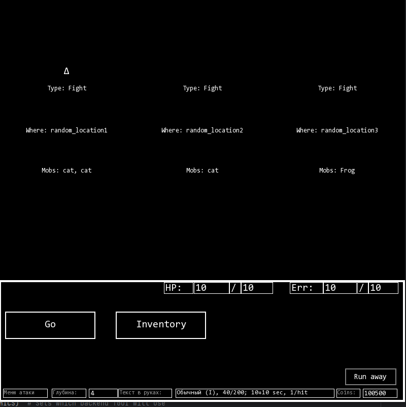
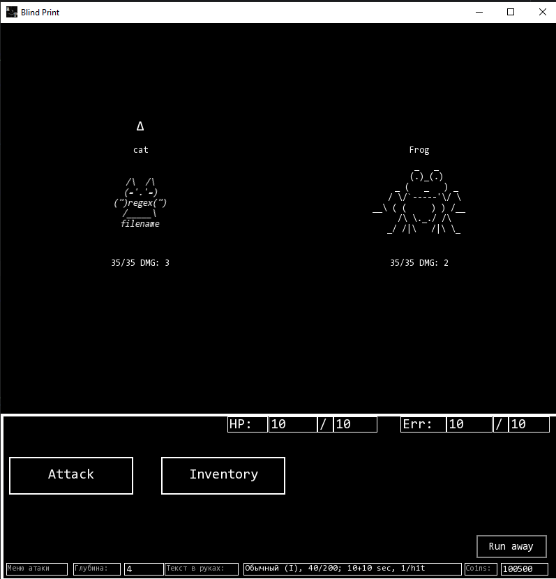

# Blind Print

## Description

Blind Print is a text-based RPG with roguelike elements about the endless library and an invisible labour.
Combat mechanics are based on a blind typing trainer.
This game was developed as part of a student project.

Also, that's my first attempt at creating games! :)

## Technical

Рекомендуется использовать Ninja для сборки и mingw32 (14.2.0) в качестве компилятора.

Обработка текста (хотя и пытается быть модульной и независимой от фронтенда), использует TGUI::String в качестве основы
для хранения символов. Возможно необходимо абстрагировать класс, хранящий строки.

## Касательно код-ревью

Наблюдаемый вами репрозиторий - временная сделанная публичной копия, чтобы мне было легче просить совета у других людей.
Может незначительно отставать от рабочего проекта.
Код достаточно большой, число классов перевалило за 30, а число строк кода медленно, но верно идёт к 10к.

Несмотря на это **кода, который что-то делает** в проекте гораздо меньше. Значительная часть написанного -
копипаста, пробрасываемые внутрь аргументы, сахар и прочие жертвы сомнительных дизайнерских решений.

- Проблема 1: Мне никогда до этого не доводилось самостоятельно планировать архитектуру. Архитектура, спланированная
  изначально, была раскритикована преподавателем, причём данные мне советы шли вразрез всему, что мне было известно. Как
  итог, нынешняя картина это ни рыба, ни мясо с самым наивным разделением, которое пришло мне в голову. Код раздут, хотя
  делает не так уж много.
- Проблема 2: Я не понимаю как тестировать подобные программы.
- Проблема 3: Я знаю C++ ровно настолько, чтобы знать, что C++ я знаю недостаточно.
- Проблема 4: Я не знаю, как менять фундаментальные особенности своего кода так, чтобы не разрушать его функциональность
  полностью. При этом в ближайшие пару недель мне необходимо представлять проект для сдачи, а в нём не хватает необходимого функционала.
  Любой фидбэк меня обрадует, но особенно востребованы советы, которым можно последовать без риска сломать вообще всё. Да здравствует принцип "Не навреди".

В соответствии с ТЗ, мне нужно стремиться к google codestyle. Для достижения этой цели, я использую Clang и линтер (
SonarQube), которые - на момент написания этого ридми - на меня заслуженно кричат.

(Моё IDE - CLion)

Учитывая существование инструментов автоматизации заострять внимание на рефакторинге не стоит.
Основная проблема заключается в местах, где линтеры помочь не могут. В картине в целом.

Комментарий касательно реализации - проект ещё не доделан. Не имплементированы функции сохранения/загрузки, отсутствует
настоящая
реализация этапа defense, а также наград за победу над мобами. Нет титров, нет настроек.
Отсутствует прогрессия по уровням, нет боссов, а также начисление монеток за победу.
Это всё - детали реализации, которые я могу расписать более подробно, но несмотря на простоту реализации каждой фичи в
отрыве от проекта, у меня возникают существенные проблемы, когда приходит время их к нынешнему коду подсоединять.

## Общее описание (нынешней) структуры


Важный комментарий - структура писалась самостоятельно, так что более чем подлежит критике. Я не ведаю что творю.

### SFML и TGUI

SFML и TGUI - две open-source библиотеки визуализации, которые я использую в этом проекте. О них важно знать две вещи:

У SFML есть главный цикл отрисовки, примерно выглядящий вот так

```
while (window.isOpen()) {
 while (const std::optional _event = window.pollEvent()) {
        // event reaction
        }
  window.clear();

      context.gui.draw();
      window.display();
  }
```

TGUI - надбиблиотека, дающая возможность создавать простой текстовый интерфейс.
Есть встроенный визуальный редактор форм, и возможность их загружать. Вся внутренняя логика построена на shared_ptr-ах и
классе виджета, который прикрепляется к разным контейнерам, будь то окно, или другой виджет.

### Слои и сцены

Структура игры +- представима Finite State Machine. В связи с этим, я думаю о происходящем в терминах иерархического
дерева состояний (сцен).

Сцена может быть или листом в графе (быть сценой в привычном понимании), или обладать массивом активных детей (т.е. быть
менеджером сцен).

Менеджеры сцен, помимо менеджмента также создают/хранят информацию, специфичную для нынешнего слоя.

Иногда сцена-ребёнок хочет попросить своего менеджера-родителя о самоубийстве.

### МесседжБас

У меня была мечта - написать прекрасный модульный код, где все составляющие не будут зависеть друг от дружки.
Мой пыл поутих, когда мне сказали, что это превращает мою архитектуру в спагетти, усложняет дебаг, и ивентбас мне стоит
использовать
только для высокоуровневой логики. Я стараюсь по возможности избавиться от него, где могу, но получается не везде.

### Json-ы

ТЗ требует загрузки ассетов из внешних файлов. В моём случае это json-ы.

Трудность заключается в том, что в некоторых json-ах мне нужно хранить информацию, касающуюся поведения тех или иных
сущностей.

В частности, реакции на использование предмета, хранятся у меня не в предмете, а в тех, кто на него должен реагировать.
В сценах (когда эффект затрагивает игрока), или мобах (отсутствующий в коде пример: огненный элементаль потухает от
использования воды).

Реализация очень тупая - парсинг текста и использование захардкоженных изначально функций. Я не знаю, есть ли способ
лучше.

### TemplateFront




Визуал игры достаточно постоянен в своём формате: снизу консоль, в которой показана информация, актуальная для забега, и
присутствуют кнопки, актуальные на данный момент. Посередине основная площадка, где рендерятся враги/варианты куда
повернуть/ НПС и прочий движ, аткуальный для сцены. Пространство сверху отведено под дополнительную информацию, которую
я однажды обязательно реализую.

Проблема в том, что от реализации такой унификации у меня по ощущениям проблем больше, чем пользы. Мне приходится
хранить PlayerPanel, потому что все сцены, которые используют этот класс знают о том, что именно хранит в себе layout.
Мне не хочется заигрывать со статическими кастами, и мне кажется, что я упускаю очевиднейшее решение.

## Used Instruments and code

(обновлю список позже)

### Code snippets

- [PubBus by eXpl0it3r] [reprository](https://github.com/eXpl0it3r/PubBus/tree/faa3f4e4818be5fd86424986bd3bf9b0bd6a876e/include/PubBus) (
  Public Domain). - slight changes in includes

### Libraries

- **SFML** (Simple and Fast Multimedia Library) – https://www.sfml-dev.org  
  License: zlib/png (i.e.`licenses/SFMLLicense.md`).
- **TGUI** (Texus' Graphical User Interface) – https://tgui.eu  
  Лицензия: zlib/png (i.e. `licenses/TGUILicense.txt`).  
